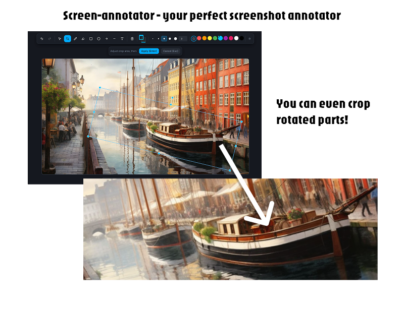

# Screen Annotator

A professional-grade, browser-based screenshot annotation tool built with React, Fabric.js, and TypeScript. Available as both a **web application** and a **Chrome extension**. Capture screens, upload images, and annotate them with shapes, text, arrows, and drawings before exporting.




## ✨ Features

- 🎨 **Rich Annotation Tools**: Draw, highlight, add shapes (rectangles, circles, arrows, lines), and text
- ✂️ **Image Cropping**: Crop images with rotation support - adjust crop area and rotate with Cmd/Ctrl+drag
- 📸 **Multiple Capture Methods**: Screen capture, file upload, clipboard paste, or demo image
- 🎯 **Precise Editing**: Transform controls with rotation, scaling, and skewing
- 🎨 **Customizable Styling**: Colors, opacity, stroke width, shadows, and arrow styles
- 📋 **Smart Features**: Undo/redo, copy/paste, grouping, layering, and context menus
- ⌨️ **Keyboard Shortcuts**: Fast workflow with comprehensive keyboard support
- 🌐 **Dual Mode**: Works as both web app and Chrome extension
- 💾 **Export Options**: Download as PNG or copy to clipboard

## 🚀 Quick Start

### As a Web Application

1. **Clone the repository**
   ```bash
   git clone <repository-url>
   cd screen-annotator
   ```

2. **Install dependencies**
   ```bash
   npm install
   ```

3. **Start development server**
   ```bash
   npm run dev
   ```

4. **Open in browser**
   Navigate to `http://localhost:8080`

### As a Chrome Extension

1. **Build the extension**
   ```bash
   npm run build
   ```

2. **Load in Chrome**
   - Open Chrome and navigate to `chrome://extensions/`
   - Enable **Developer mode** (toggle in top-right corner)
   - Click **Load unpacked**
   - Select the `dist/` folder from your project

3. **Use the extension**
   - Click the extension icon in your toolbar, or
   - Press `Ctrl+Shift+S` (Windows/Linux) or `Cmd+Shift+S` (Mac)

## 📖 Usage Guide

### Capture Methods

#### Web Application
- **Capture Screen**: Click "Capture Screen" to share your screen, window, or browser tab
- **Upload Image**: Click "Upload Image" to select an image file from your device
- **Try Demo**: Click "Try Demo Image" to load a sample image
- **Paste**: Use `Cmd/Ctrl+V` to paste images from your clipboard

#### Chrome Extension
- **Extension Icon**: Click the extension icon in your Chrome toolbar
- **Keyboard Shortcut**: Press `Ctrl+Shift+S` (Windows/Linux) or `Cmd+Shift+S` (Mac)
- The current tab will be captured and opened in the editor

### Annotation Tools

| Tool | Shortcut | Description |
|------|----------|-------------|
| **Select** | `V` | Select and move objects |
| **Crop** | `X` | Crop and rotate images - adjust area, hold Cmd/Ctrl on corners to rotate |
| **Draw** | `P` | Freehand drawing |
| **Highlight** | `H` | Highlight areas with semi-transparent overlay |
| **Rectangle** | `R` | Draw rectangles |
| **Circle** | `C` | Draw circles |
| **Arrow** | `A` | Draw arrows with customizable endpoints |
| **Line** | `L` | Draw straight lines |
| **Text** | `T` | Add text annotations |

### Editing Features

- **Image Cropping**: 
  - Press `X` to enter crop mode
  - Adjust crop area by dragging handles
  - Rotate crop area by holding `Cmd/Ctrl` and dragging corner handles
  - Press `Enter` to apply crop or `Escape` to cancel
- **Transform Controls**: 
  - Corner handles: Scale uniformly (hold `Cmd/Ctrl` to rotate)
  - Side handles: Scale on one axis (hold `Cmd/Ctrl` to skew)
- **Layering**: Right-click → Arrange to change object order
- **Grouping**: Select multiple objects → Right-click → Group (`Cmd+G`)
- **Copy/Paste**: `Cmd/C` to copy, `Cmd/V` to paste
- **Undo/Redo**: `Cmd/Z` and `Cmd/Shift+Z` (supports crop undo/redo)

### Export Options

- **Download**: Click the download button to save as PNG (2x resolution for retina displays)
- **Copy**: Click the copy button to copy to clipboard
- **Add URL**: Add the source URL as text overlay
- **Add Date/Time**: Add timestamp as text overlay

## ⌨️ Keyboard Shortcuts

### Tool Selection
- `V` - Select tool
- `X` - Crop tool
- `P` - Draw tool
- `H` - Highlight tool
- `R` - Rectangle tool
- `C` - Circle tool
- `A` - Arrow tool
- `L` - Line tool
- `T` - Text tool

### Editing
- `Cmd/Ctrl+C` - Copy selected objects
- `Cmd/Ctrl+V` - Paste objects or images
- `Cmd/Ctrl+D` - Duplicate selected objects
- `Cmd/Ctrl+G` - Group selected objects
- `Cmd/Ctrl+Shift+G` - Ungroup
- `Delete/Backspace` - Delete selected objects
- `Escape` - Deselect all / Cancel crop
- `Enter` - Apply crop (when in crop mode)

### Layer Management
- `Cmd/Ctrl+]` - Bring forward
- `Cmd/Ctrl+[` - Send backward
- `Cmd/Ctrl+Shift+]` - Bring to front
- `Cmd/Ctrl+Shift+[` - Send to back

## 🛠️ Technology Stack

This project is built with modern web technologies:

- **React 18** - UI framework
- **TypeScript** - Type safety
- **Vite** - Build tool and dev server
- **Fabric.js** - Canvas rendering and object manipulation
- **Tailwind CSS** - Styling
- **Radix UI** - Accessible UI primitives
- **Lucide React** - Icon library
- **Sonner** - Toast notifications
- **React Router** - Client-side routing

## 🏗️ Development

### Project Structure

```
screen-annotator/
├── src/
│   ├── components/          # React components
│   │   ├── ui/              # Reusable UI components
│   │   ├── ScreenshotEditor.tsx
│   │   ├── Toolbar.tsx
│   │   └── ...
│   ├── lib/                 # Utility functions
│   ├── pages/               # Page components
│   └── assets/              # Static assets
├── public/                  # Public assets and manifest
├── dist/                    # Build output (extension)
└── vite.config.ts           # Vite configuration
```

### Available Scripts

- `npm run dev` - Start development server
- `npm run build` - Build for production
- `npm run preview` - Preview production build
- `npm run lint` - Run ESLint

### Building the Extension

The extension is built to the `dist/` folder. After running `npm run build`:

1. The `dist/` folder contains all necessary files
2. Load it in Chrome via `chrome://extensions/`
3. The extension will capture screenshots and open them in the editor

### Publishing to Chrome Web Store

To distribute your extension through the Chrome Web Store:

1. **Read the complete guide**: See [CHROME_WEB_STORE_GUIDE.md](./CHROME_WEB_STORE_GUIDE.md) for detailed instructions
2. **Quick steps**:
   - Pay the one-time $5 developer registration fee
   - Build your extension: `npm run build`
   - Create a ZIP file from the `dist/` folder contents
   - Upload to [Chrome Web Store Developer Dashboard](https://chrome.google.com/webstore/devconsole)
   - Complete store listing (description, screenshots, privacy policy)
   - Submit for review (typically 1-3 business days)

**Required for submission:**
- ✅ Extension icons (already have)
- 📸 Screenshots (use your `screen-annotator.png` as base)
- 📄 Privacy Policy URL (required because extension uses `storage` permission)
- 🎨 Promotional tiles (optional but recommended)

## 🎨 Built With

This project was built using:

- **[Lovable](https://lovable.dev)** - AI-powered development platform
- **[Cursor](https://cursor.sh)** - AI-powered code editor

Special thanks to the Lovable and Cursor teams for making this development experience possible.

## 📝 License

This project is open source and available under the [MIT License](LICENSE).

## 🤝 Contributing

Contributions are welcome! Please feel free to submit a Pull Request.

## 📧 Support

For issues, questions, or suggestions, please open an issue on GitHub.

---

Made with ❤️ using Lovable and Cursor
